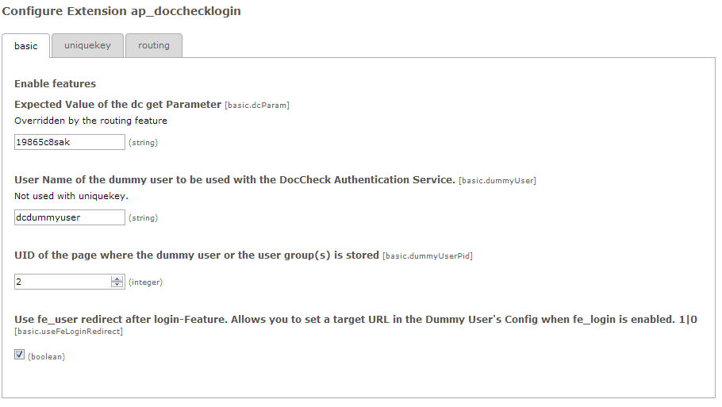
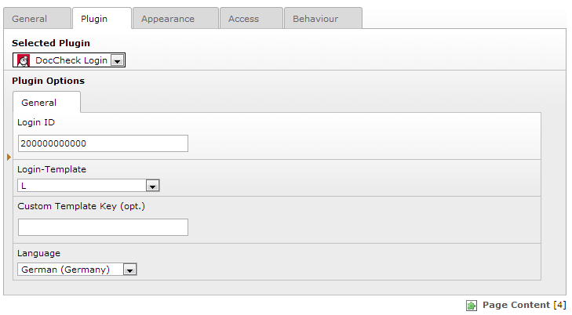
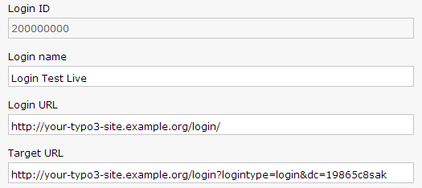

.. ==================================================
.. FOR YOUR INFORMATION
.. --------------------------------------------------
.. -*- coding: utf-8 -*- with BOM.

.. include:: ../Includes.txt

.. _admin-manual:

Administrator Manual
====================

These steps cover only the basic functionality. We'll care about the advanced
features (unique key, routing, etc) in the :ref:`configuration` section.

.. _admin-step0:

Step 0: Apply for a DocCheck Login
----------------------------------

In order to use this extension, you will need a valid DocCheck Login ID, as
well as access to DocCheck CReaM, the login configuration backend. Head over
to `DocCheck CReaM`_ to make sure you have both! For the basic
functionality, the free DocCheck Basic License should suffice.

.. _DocCheck CReaM: https://crm.doccheck.com/

.. _admin-step1:

Step 1: Create a Dummy User
---------------------------

As this Extension will log in a TYPO3 User for you, you must first create a
front end user group, and a front end user.

Please choose a **long and random password** for the front end user – you'll never
have to type it again, I promise.

.. _admin-step2:

Step 2: Configure the Extension
-------------------------------

Now we'll have to configure the extension using the extension manager (Click on
the gear icon next to the extension name).

Set :ts:`basic.dcParam` to any string that is valid for a URI query parameter
and write it down, as you'll need it in :ref:`admin-step4`.

Oh, and see the section :ref:`configuration` of this Manual, to find out what
the parameters mean.

.. _admin-step3:

Step 3: Insert the Plugin
-------------------------

On an unprotected page (i.e. wherever the login form should appear), insert a
“General Plugin”-Content Record and choose the “DocCheck Login” plugin. Supply
your registered Login ID, and select a Login Template (Size) and/or languge.
If you want, you can order a custom DocCheck Login Template via your DocCheck
Sales Contact (But the red default layout looks pretty, too).

.. _admin-step4:

Step 4: Configure your DocCheck Login
-------------------------------------

Head over to `DocCheck CReaM`_ and configure your DocCheck Login.

“Login URL” must be set to the page where you just inserted the plugin.

“Target URL” will be the same, but with two additional Query Parameters:

* ``dc=...``: This parameter equals to the string you chose for “basic.dcParam” in :ref:`admin-step2`.
* ``logintype=login``: This triggers TYPO3 login mechanism

This means: If your login form plugin is located at ``http://your-typo3-site.example.org/login/``,
and your :ts:`basic.dcParam` is ``19865c8sak``, your Target URL will be:

``http://your-typo3-site.example.org/login/?logintype=login&dc=19865c8sak``

		
That's it!

.. _admin-step5:

Step 5: Enable DocCheck Search Feature (optional)
-------------------------------------------------

Head back to the extension configuration in the Extension Manager.

Choose tab "Crawling" and enable the crawling for DocCheck.

Enter an username that has access to the protected pages.

Enter the IP of the DocCheck Crawler. Please get in touch with the DocCheck crew if you don't know what to do here.

Please install an extension that creates a Google Sitemap.