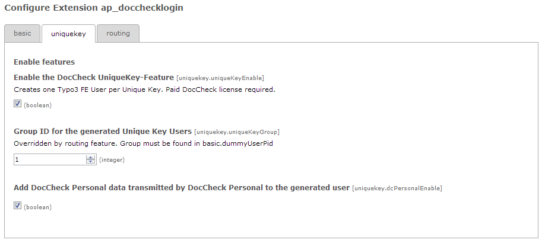
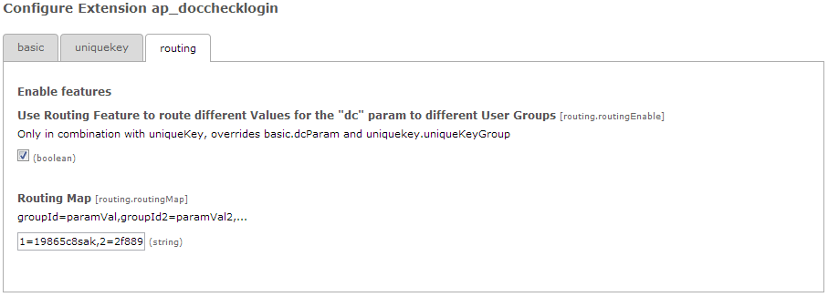

.. ==================================================
.. FOR YOUR INFORMATION
.. --------------------------------------------------
.. -*- coding: utf-8 -*- with BOM.

.. include:: ../Includes.txt

.. _introduction:

Introduction
============

.. _what-it-does:

What does it do?
----------------

This extension integrates the popular DocCheck Login Service with your TYPO3
6.x-Website. It is currently maintained by antwerpes ag (a subsidiary of
DocCheck AG), in close cooperation with DocCheck.

It supports the **basic functionality** by logging in a dummy frontend user
whenever someone has been authorized by DocCheck.

It supports the **Unique Key feature** (optional, requires license *Economy*
or higher), which allows you to identify returning visitors, by creating one
frontend user per unique DocCheck User.

It supports the **DocCheck Routing feature** family, allowing you to configure
different frontend user groups for different routing targets.

It supports the **DocCheck Personal feature** (optional, requires license
*Business* and the Unique Key feature), which will augment your Unique
DocCheck User by some person-related data – given, that the user agrees
to this data transmission.

.. _screenshots:

Screenshots
-----------

Configuration Screen
^^^^^^^^^^^^^^^^^^^^

.. figure:: ../Images/ConfigScreen.png
		:width: 500px
		:alt: Configuration Screen

		Configuration Screen: Basic

		This is the Configuration Screen, reachable from the gear icon in the
		TYPO3 extension manager.

		Configuration Screen: Unique Key

		The options for using the Unique Key feature
		

		Configuration Screen: Routing

		The options for using the Routing features.
		
Plugin Configuration
^^^^^^^^^^^^^^^^^^^^
.. figure:: ../Images/PiConfig.png
		:width: 500px
		:alt: Plugin Configuration

		Plugin Configuration

		The Settings within the plugin flexform
		
Frontend View
^^^^^^^^^^^^^^^^^^^^
.. figure:: ../Images/PiOutput.png
		:width: 500px
		:alt: Plugin Configuration

		Default Login-Form

		Language will vary.